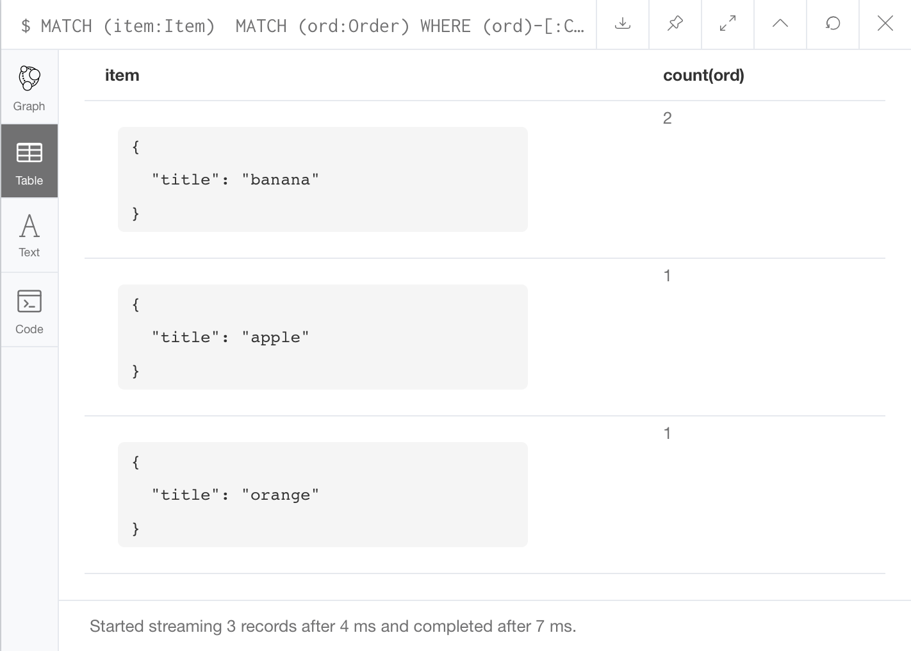

## Task 3 - Neo4j

by Teodor Romanus

#### Database structure

```
CREATE (ban:Item {title:'banana'})
CREATE (app:Item {title:'apple'})
CREATE (ora:Item {title:'orange'})

CREATE (ord1:Order {name: 'order 1'})
CREATE (ord2:Order {name: 'order 2'})

CREATE (cus1:Customer {name:'Alice'})
CREATE (cus2:Customer {name:'Bob'})

CREATE
    (ord1)-[:CONTAINS]->(ban),
    (ord1)-[:CONTAINS]->(app),
    (ord1)-[:CONTAINS]->(ora),
    (ord2)-[:CONTAINS]->(ban)

CREATE
    (cus1)-[:ORDERED]->(ord1),
    (cus2)-[:ORDERED]->(ord2)

CREATE 
    (cus1)-[:VIEWED]->(ban),
    (cus1)-[:VIEWED]->(app),
    (cus1)-[:VIEWED]->(ora),
    (cus2)-[:VIEWED]->(ban),
    (cus2)-[:VIEWED]->(app),
    (cus2)-[:VIEWED]->(ora)
```


#### 1.	Знайти Items які входять в конкретний Order

```
MATCH (ord:Order) WHERE ord.name = 'order 1'
MATCH (item:Item) WHERE (ord)-[:CONTAINS]->(item) 
RETURN item
```


#### 2. Знайти всі Orders конкретного Customer

```
MATCH (cus:Customer) WHERE cus.name = 'Alice'
MATCH (ord:Order) WHERE (cus)-[:ORDERED]->(ord)
RETURN ord
```


#### 3. Знайти всі Items куплені конкретним Customer

```
MATCH (cus:Customer) WHERE cus.name = 'Alice'
MATCH (item:Item) WHERE (cus)-[:ORDERED]->()-[:CONTAINS]->(item)
RETURN item
```


#### 4. Знайти кількість Items куплені конкретним Customer

```
MATCH (cus:Customer) WHERE cus.name = 'Alice'
MATCH (item:Item) WHERE (cus)-[:ORDERED]->()-[:CONTAINS]->(item)
RETURN count(item)
```


#### 5. Знайті скільки разів кожен товар був придбаний

```
MATCH (item:Item) 
MATCH (ord:Order) WHERE (ord)-[:CONTAINS]->(item)
RETURN item, count(ord)
```



#### 6. Знайти всі Items переглянуті (view) конкретним Customer

```
MATCH (cus:Customer) WHERE cus.name = 'Bob'
MATCH (item:Item) WHERE (cus)-[:VIEWED]->(item)
RETURN item
```


#### 7. Знайти всі Items переглянуті (view), але не куплені конкретним Customer

```
MATCH (cus:Customer) WHERE cus.name = 'Bob'
MATCH (item:Item) WHERE (cus)-[:VIEWED]->(item) AND NOT (cus)-[:ORDERED]->()-[:CONTAINS]->(item)
RETURN item
```


#### 8. Знайти Items що куплені разом з конкретним Item (тобто все Items що входять до Order разом з даними Item)

```
MATCH (item:Item) WHERE item.title = 'banana'
MATCH (ord:Order)
MATCH (item2:Item) WHERE (ord)-[:CONTAINS]->(item) AND (ord)-[:CONTAINS]->(item2) AND item <> item2
RETURN item2
```


#### 9. Знайти Customers які купили даний конкретний Item

```
MATCH (item:Item) WHERE item.title = 'banana'
MATCH (cus:Customer) WHERE (cus)-[:ORDERED]->()-[:CONTAINS]->(item)
RETURN cus
```


#### 10. Знайти всі Items куплені Customer(s) які купили даний конкретний Item

```
MATCH (item:Item) WHERE item.title = 'orange'
MATCH (cus:Customer)
MATCH (item2:Item) WHERE (cus)-[:ORDERED]->()-[:CONTAINS]->(item) AND (cus)-[:ORDERED]->()-[:CONTAINS]->(item2)
RETURN item2
```


#### 11. Знайти всі Items куплені Customer(s) який переглядав даний конкретний Item

```
MATCH (item:Item) WHERE item.title = 'orange'
MATCH (cus:Customer)
MATCH (item2:Item) WHERE (cus)-[:VIEWED]->(item) AND (cus)-[:ORDERED]->()-[:CONTAINS]->(item2)
RETURN item2
```


#### 12. Так само як і #7